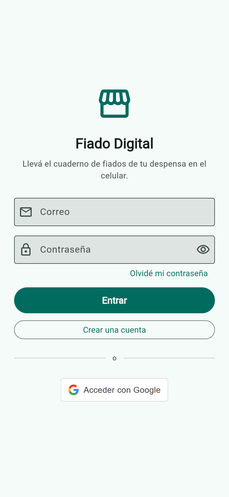
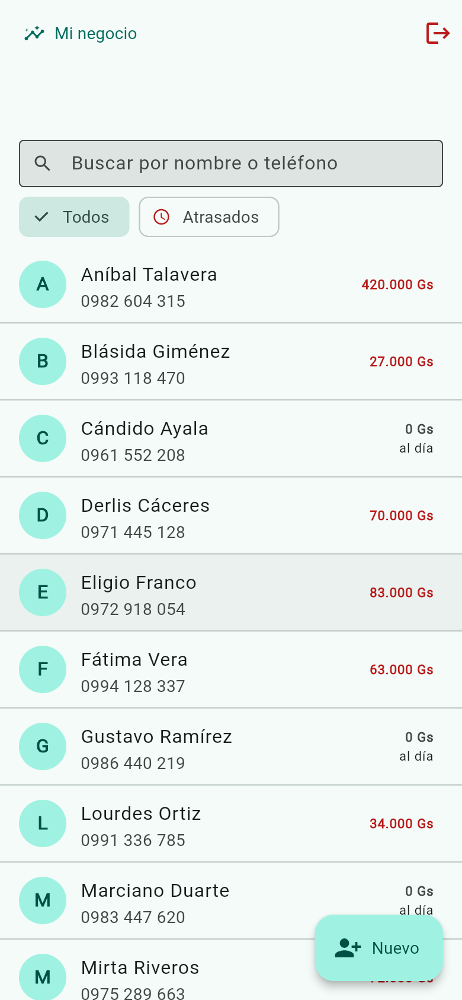
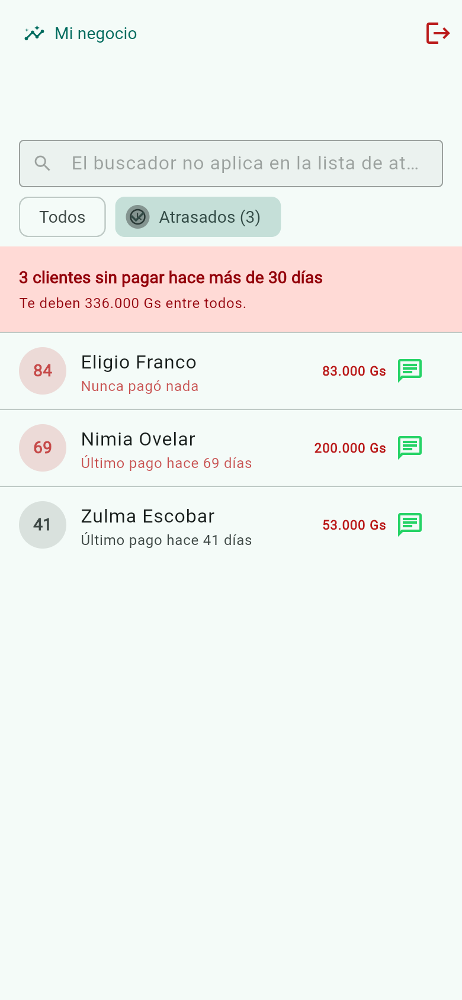
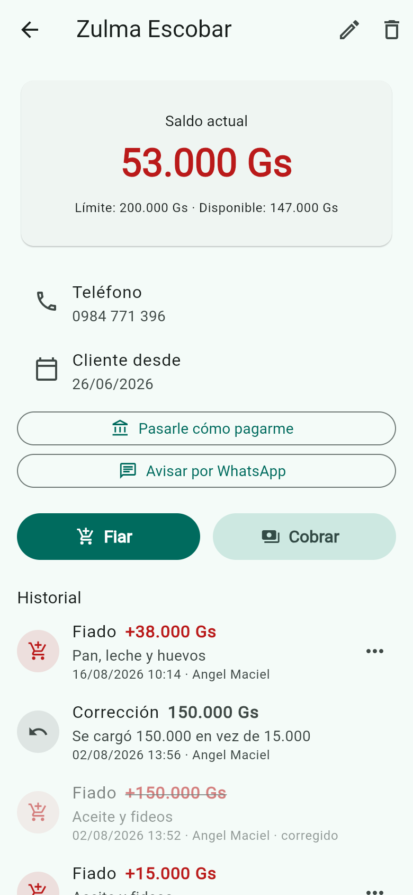
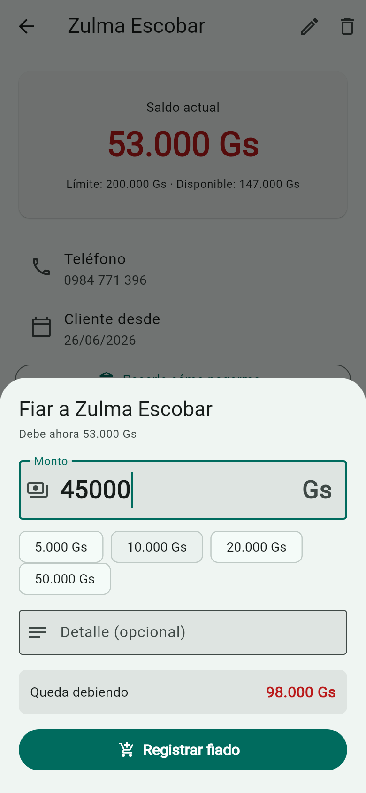
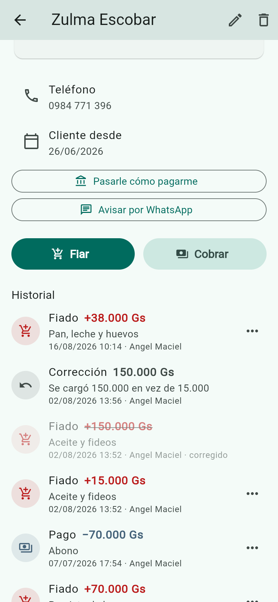
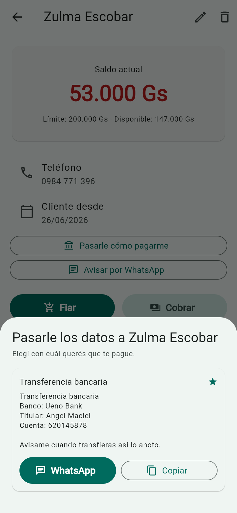
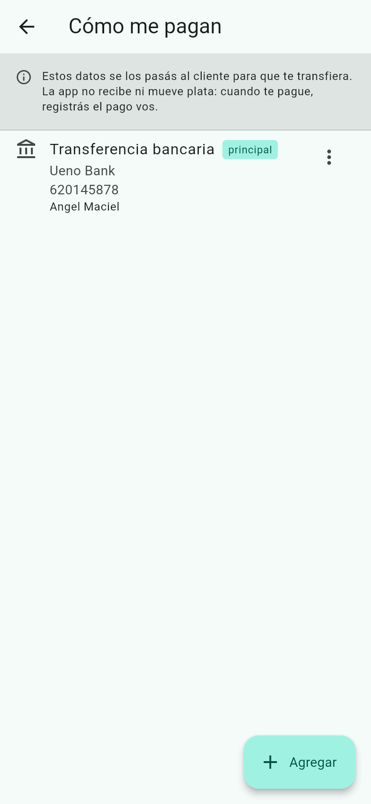
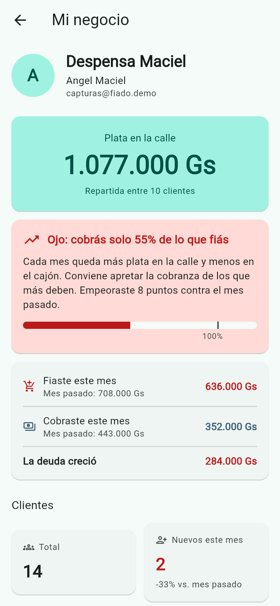

# Fiado Digital

[](https://github.com/angelmaciel/fiado-digital/actions/workflows/ci.yml)

App multiplataforma para que despensas y almacenes de barrio en Paraguay
digitalicen el registro de ventas a crédito —el **fiado**— sin dejar de trabajar
como venían trabajando.

Corre en **Android, Windows y Web**, con la misma API y la misma base.

## Probala

**<https://fiado-digital-web.onrender.com>**

```
correo:     capturas@fiado.demo
contraseña: capturas-fiado-2026
```

Esa cuenta viene con 24 clientes y 98 movimientos repartidos en 90 días: gente
al día, atrasados, uno pasado de su límite y un fiado corregido. También podés
crear la tuya.

Está en el plan gratuito de Render, así que **la primera visita puede tardar
hasta un minuto** mientras el servicio se despierta.

## Cómo se ve

| | | |
|:---:|:---:|:---:|
|  |  |  |
| Correo y contraseña, o Google | Quién te debe y cuánto | Atrasados, con los días sin pagar |
|  |  |  |
| Saldo, límite e historial | El saldo resultante, en vivo | Un fiado corregido, sin borrar nada |
|  |  |  |
| Pasarle los datos para que transfiera | Las cuentas para cobrar | Cuánta plata hay en la calle |

## Las tres decisiones que definen la app

**Los movimientos son inmutables.** Nunca se editan ni se borran. Un error se
corrige creando un movimiento `AJUSTE` que apunta al original, y el equivocado
queda tachado a la vista. Es como funciona el cuaderno de papel, y es lo que
permite que dueño y cliente miren la misma cuenta sin discutir.

**La mora se mide desde el último pago, no desde la última compra.** Un cliente
que compró ayer pero no paga hace dos meses aparece como atrasado. Es el que más
conviene ver en esa lista, no el que menos.

**Se puede trabajar sin internet.** Los clientes y movimientos se guardan en el
dispositivo en una base cifrada con SQLCipher. Lo que se anota sin señal sube
solo cuando vuelve, conservando la hora en que se anotó.

## Qué está verificado, y cómo

**[docs/pruebas.html](docs/pruebas.html)** — se abre en el navegador.

| | |
| --- | --- |
| Pruebas automatizadas | 87 (58 backend, 29 app) |
| Defectos encontrados y corregidos | 19, cada uno con su causa raíz |
| Plataformas probadas a mano | Web, Windows, Android e iPhone |

Nueve de esos defectos **no había forma de encontrarlos leyendo código**:
aparecieron probando en un celular real, cortándole la red a un Android o
mirando capturas de pantallas terminadas.

## Estructura

```
fiado-digital/
├── backend/         API REST — NestJS + Prisma + PostgreSQL (Neon)
├── app/             Cliente Flutter + Riverpod (Android / Windows / Web)
├── docs/            Pruebas, despliegue y flujo de trabajo
├── tools/capturas/  Genera las capturas de este README con un comando
└── render.yaml      Los dos servicios desplegados, versionados
```

Cada funcionalidad de la app se divide en `domain/` (modelos), `data/` (HTTP),
`application/` (estado con Riverpod) y `presentation/` (pantallas).

## Conceptos del dominio

- **Fiado** — venta a crédito registrada a nombre de un cliente.
- **Pago** — abono que el cliente hace contra su deuda.
- **Ajuste** — el único mecanismo de corrección.
- **Saldo** — `Σ FIADO − Σ PAGO (± AJUSTE)`.
- **Montos** — guaraníes, siempre enteros. Sin decimales.

## Autenticación

Dos formas de entrar: **correo y contraseña**, con verificación por código de 6
dígitos y recuperación; o **Google**.

Para Google hay dos caminos, porque `google_sign_in` no soporta Windows:

- **Android y Web** — la app obtiene un `id_token` y lo manda a `POST /api/auth/google`.
- **Windows** — se abre el navegador contra `GET /api/auth/google` y la app espera
  los tokens en un servidor local en el puerto 8765.

El backend firma un access token RS256 de 15 minutos y un refresh token opaco de
30 días, del que en la base solo se guarda el SHA-256 y que rota en cada uso.

## Cómo levantarlo

El backend va primero: la app no arranca sin API.

```bash
cd backend && npm install && npm run start:dev
cd app     && flutter run -d chrome --web-port=5000
```

El detalle de cada parte está en [backend/README.md](backend/README.md) y
[app/README.md](app/README.md). Las variables de entorno, en
[backend/.env.example](backend/.env.example).

## Cómo se trabaja

`main` es lo estable y solo recibe merges al cerrar un sprint, con un tag.
`develop` acumula el sprint en curso, y cada historia sale en su propia rama
`feature/HU-XX-...`. El detalle está en [docs/flujo-git.md](docs/flujo-git.md).

Cada push a `main` o `develop` dispara la CI: type-check y build del backend,
más formato, análisis, pruebas y build web de la app.

Las capturas de este README se regeneran con un comando:

```bash
cd tools/capturas && npm run capturar
```

## Despliegue

Los dos servicios están definidos en [render.yaml](render.yaml) y siguen `main`.
Los pasos, los valores que van a mano y lo que hay que registrar en Google Cloud
Console están en [docs/despliegue.md](docs/despliegue.md).
